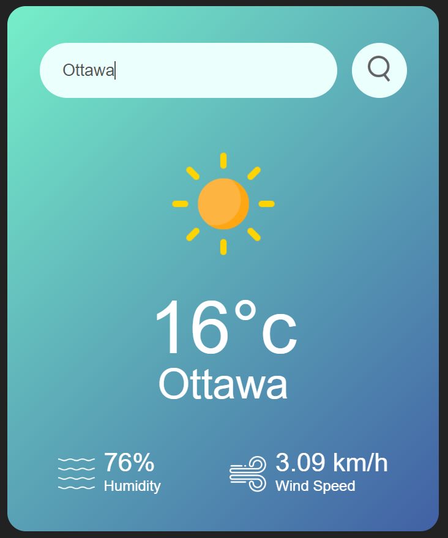

# weather_app
Weather Web Page using JavaScript, GreatStack's tutorial on [youtube](https://www.youtube.com/watch?v=MIYQR-Ybrn4) was used to create this project.

The code was slightly customized with different variable names and support for pressing Enter.

# demo

You can start a local web server using python using the following command at the root of the repo: python -m http.server

Open http://127.0.0.1:8000/ in your favorite browser, specify your city, press Enter or the search icon, and see the current weather.

## Input city name

## Fetch and display live temperature
